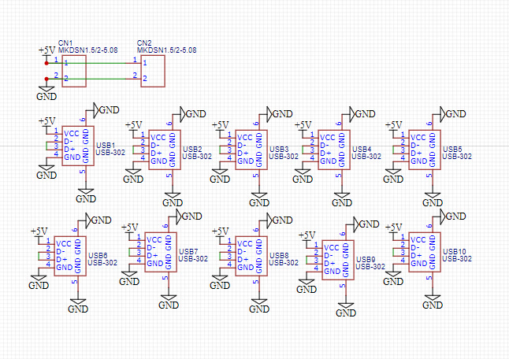
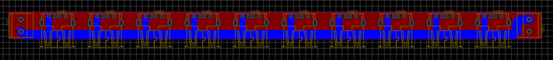
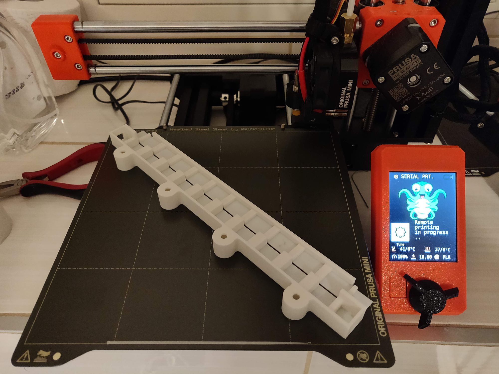
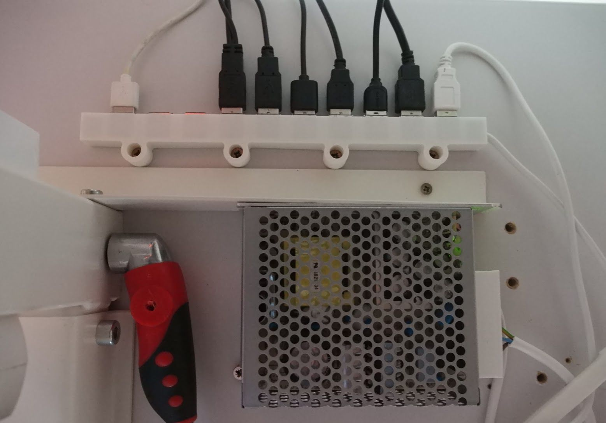

I have a zillion of different USB powered devices that require dumb simple 5V supply. About 10 of them is always on on my my desk. So having a number of AC usb power adapters may eat all available sockets quickly. So I've decided to make a DIY USB-power HUB with 10 sockets.

<!--more-->

Schematics is dead simple 5V in parallel, and shortcut D+ and D- lines. All devices I've tried - including iOS and Android phones charge just fine.

Case is 3d printed and designed in Fusion 360 ([thingiverse](https://www.thingiverse.com/thing:4402947)) and can be printed diagonally on a printer with at least 18x18cm build plate, like mine Original Prusa Mini.

As an AC-DC adapter I use MeanWell RS-75-5 which provides up to 12A of current, more than enough for all my tasks.

So just few screws and hub is mounted to the desk:

Is it cheaper or better than off-the-shelf power hubs? Not really. But if you are a maker, you know the real profit of such projects, it's just fun to make!

### Download:

1. Thingiverse project <https://www.thingiverse.com/thing:4402947>
2. EasyEDA project <https://easyeda.com/sergey.silnov/usba-line>
