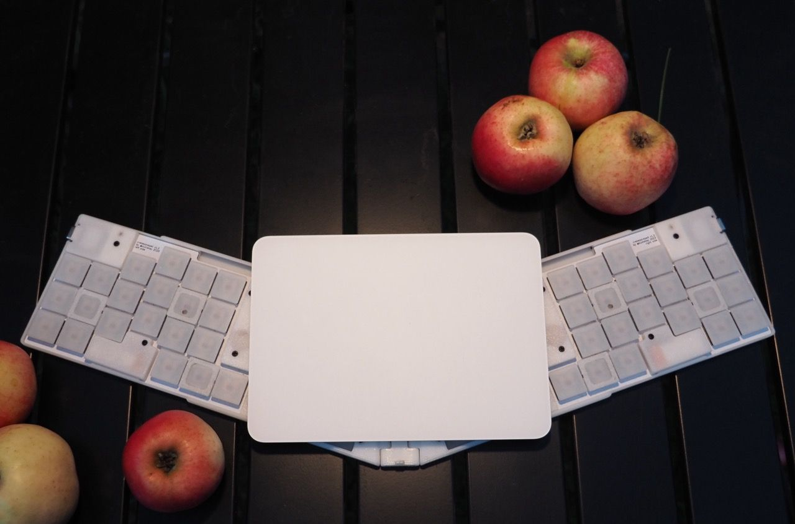
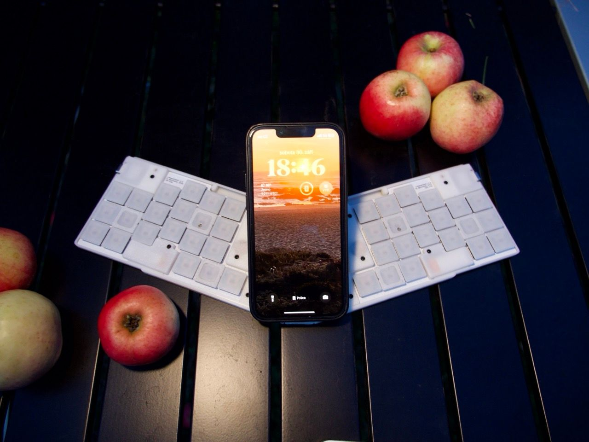
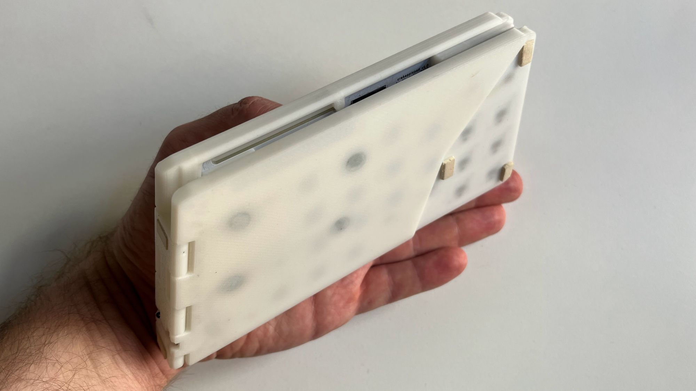
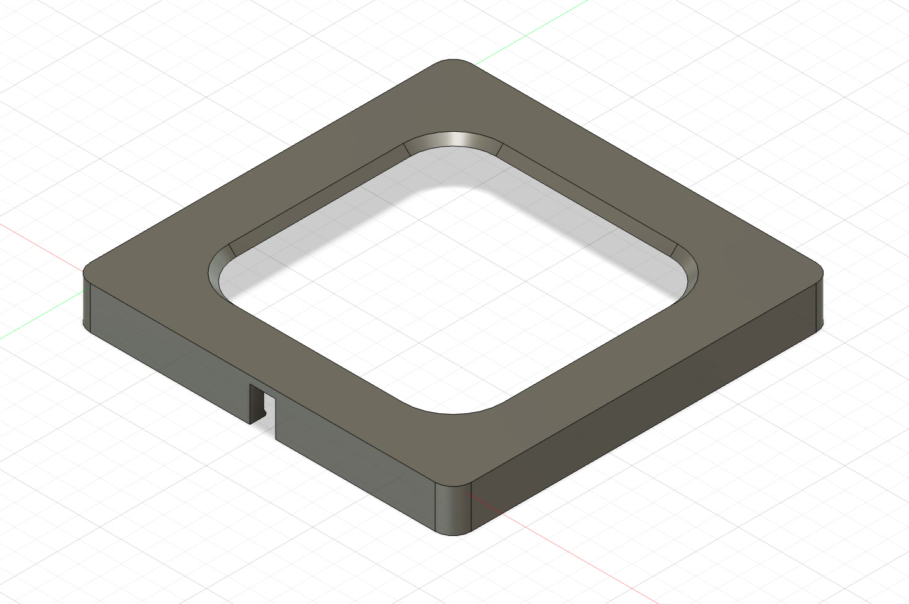
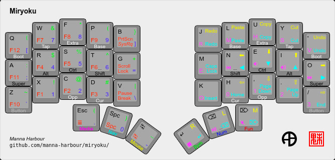

For a whole decade, I was loyal to my Microsoft Natural Ergonomic 4000 keyboard. So much so, I had three of them—one for home, one for work and one I used during rare visits to my hometown. And life was good. That was until my morning coffee shop visits instilled in me the desire to write down some notes, sparking the need for a mobile keyboard.

**A Mobile Dream**

As much as I loved my stationary keyboards, they weren't cut out for the mobile life. The available options didn't match the ergonomic standards I had grown used to. Sure, the Microsoft keyboard wasn't perfect, but the problems with most traditional keyboards are glaring. For one, our agile thumbs are wasted on a single space key, while our little fingers, especially when coding, bear an unfair load. The asymmetry of keyboard halves, the diagonal movement of fingers, and the excessive number of keys all bothered me.

<!--more-->

**Crafting My Own**

Determined to have my cake and eat it too, I designed my solution: a tiny foldable ultraslim keyboard split into two halves. Essentially, two independent keyboards. It comes with a built-in mobile phone holder, perfect for coffee shop scenarios. Plus, with my MacBook and iPad in mind, the keyboard can extend and magnetically attach to an Apple trackpad. The result? A versatile piece of tech.

**Overcoming Hurdles**

No invention is without its challenges. The entire structure operates on Bluetooth, meaning the left half connects to the computer, while the right half links to the left. Consequently, the left half's battery drains faster. It's hard to solve the problem entirely, but in the folded state both parts are connected and can be charged together with one USB cable. Another design challenge was the choice of switches. I opted for the thinnest available, the [Kailh PG1425 X-switch](https://www.kailhswitch.com/mechanical-keyboard-switches/low-profile-key-switches/low-profile-switch-for-notebook.html). While they're sleek, the keycap options are limited. Only one option exists. And there are no options with bumps to find home position. I tried drilling holes, but it didn't work well. Eventually, I designed custom frames around keycaps to tackle this.

**Tailored to Perfection**

The layout is based on the [miryoku](https://github.com/manna-harbour/miryoku) design, with an added column to comfortably house all Cyrillic letters. The Russian alphabet layout is almost traditional, I only shifted the 'X' key from the right to the left, making it more symmetrical.

More unusual is the placement of modifier keys. Shifts are positioned under the index fingers, a quick press results in a letter, while a longer press acts as a modifier. The Command, Alt, and Control keys work the same way located in the default positions.

**Quality Comes at a Price**

This keyboard wonder doesn't come cheap. Just the components tally up to well over 200 euros. Kailh X switches are expensive (and hard to find) Yet, over the past three months, I've been inseparable from it. It's just that cool.

**In Conclusion**

Designing my keyboard has been a journey of understanding and innovation, and sheer will.  But believe me, every key press feels worth it.

Source of software and hardware are available at <https://github.com/kumekay/crabapplepad>
