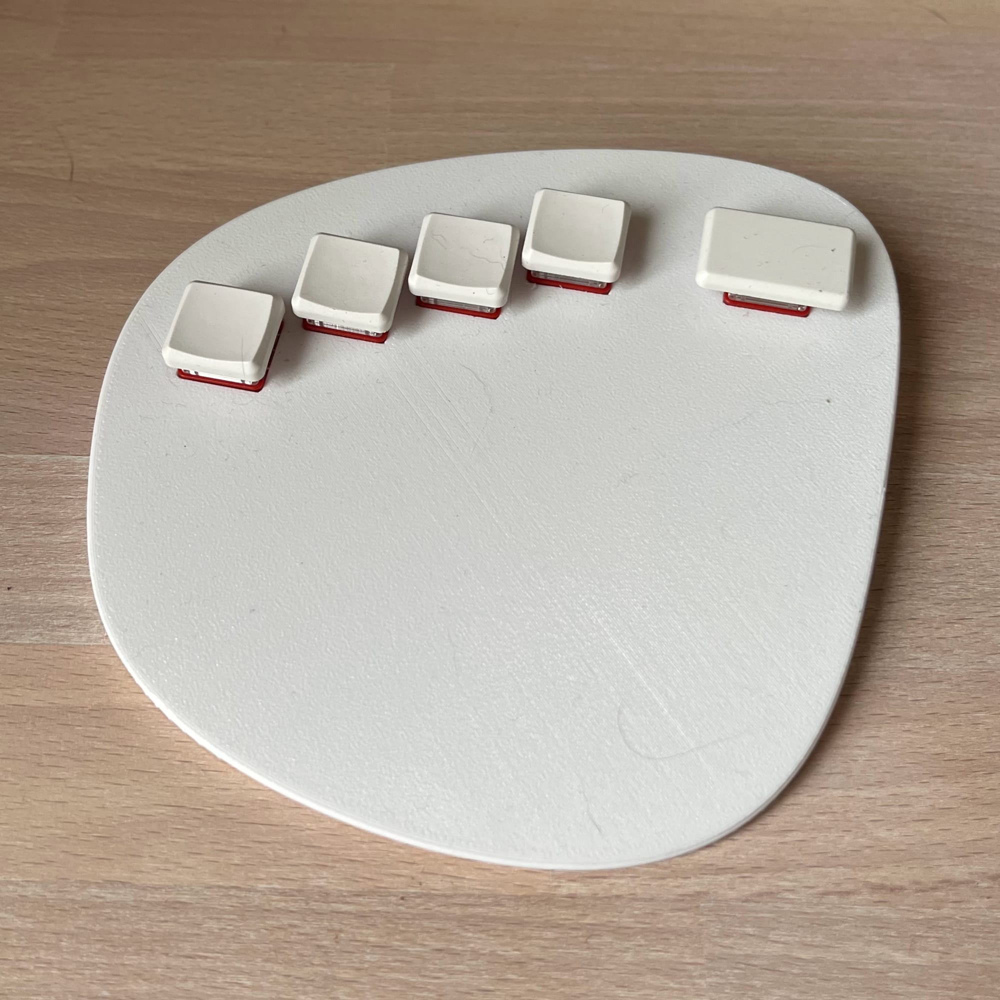
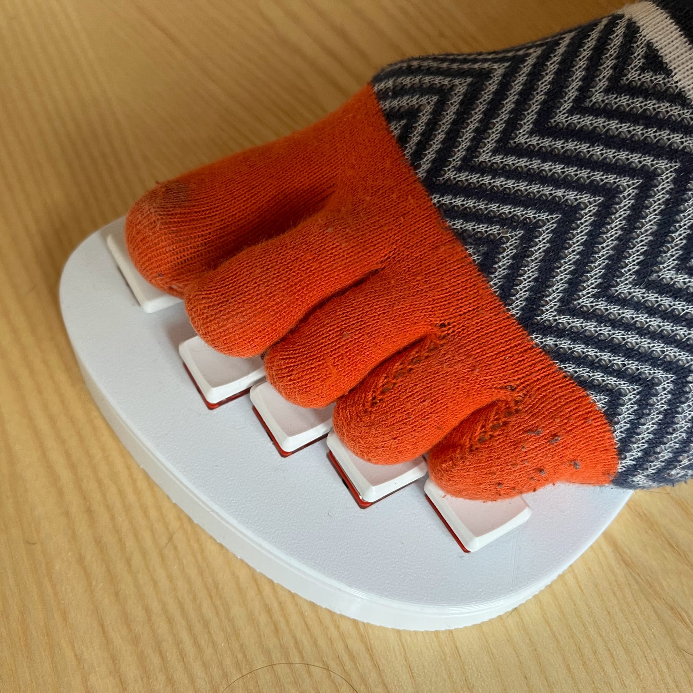
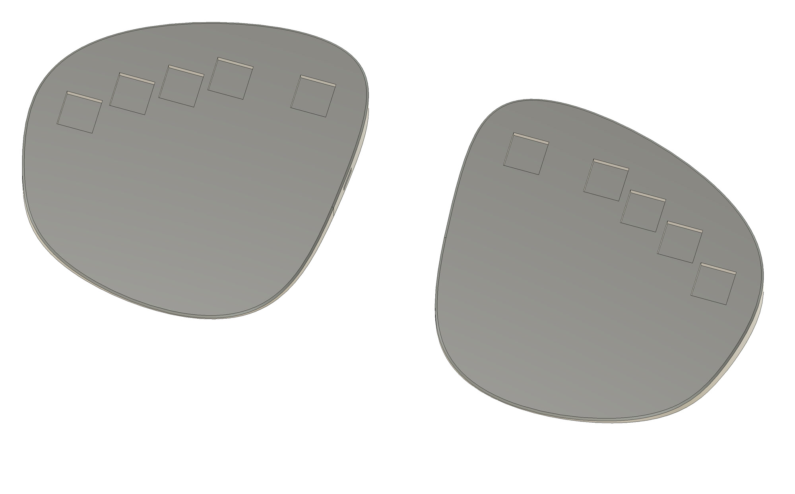

I always wished for two extra hands to manage daily tasks and become a superhero. However, it dawned on me recently that I have another set of fingers - my toes!

Is it possible to use toes practically? Apparently, yes! Certain cultures and tribes use their feet's toes to play kalimbas, grind corn, or cook meals.

After some practice, individuals can improve their foot mobility and coordination. It's worth giving it a try.

<!--more-->

Nonetheless, there is one problem. As someone who resides in a civilized urban area, I spend most of my time wearing shoes, if not sneakers, then slippers. Socks are also typically worn. Luckily, there is an easy solution - finger socks!

It's fun to pick up fall objects like pens and flash drives, not to lean.  
Feet mobility wasn't the only reason, but I started to attend yoga classes and in general, spend more time without shoes.

The next step is obvious. As a software developer, I spend quite some time in front of my computer. Would it be possible to leverage a few more keys I can press with my feet? I think so.

I decided to make a special keyboard to type with my toes. It’s hard to expect toe mobility to be great from the very beginning, so I limited the number of keys to 10. One key per toe.

The keyboard consisting of two halves, each with five keys, arranged to be convenient for my feet. The keyboard is completely wireless, so it can be placed on the floor however you want.

It is programmed to enter numbers from 0 to 9. Not very useful, but my task is simply to learn to type anything with my feet. A more useful scenario can be thought of later.

I played with it for about a week and to be honest, I did not achieve much. I learned to press the buttons well with my big toe, pinky, and more or less with my index toe, but not at all with my ring and middle toes.

I can believe that after more diligent training, I can type with my ring toe, but I still have questions whether it is possible with the middle toe. The index and middle toes on the foot just don't want to move independently and always move together.

This keyboard is scrapped now, but I decided to share the model mainly to inspire others to experiment more.

Source files: <https://github.com/kumekay/Toepad>
