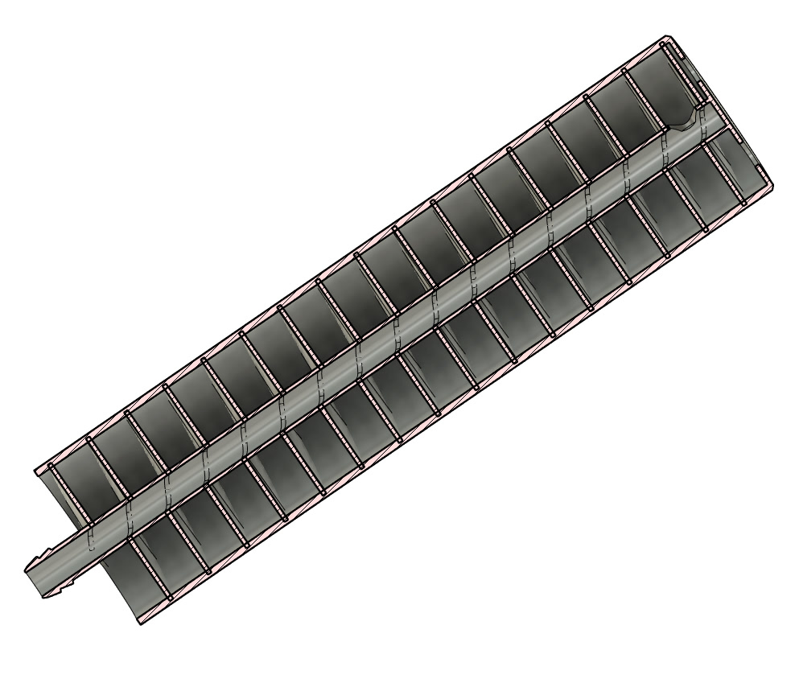
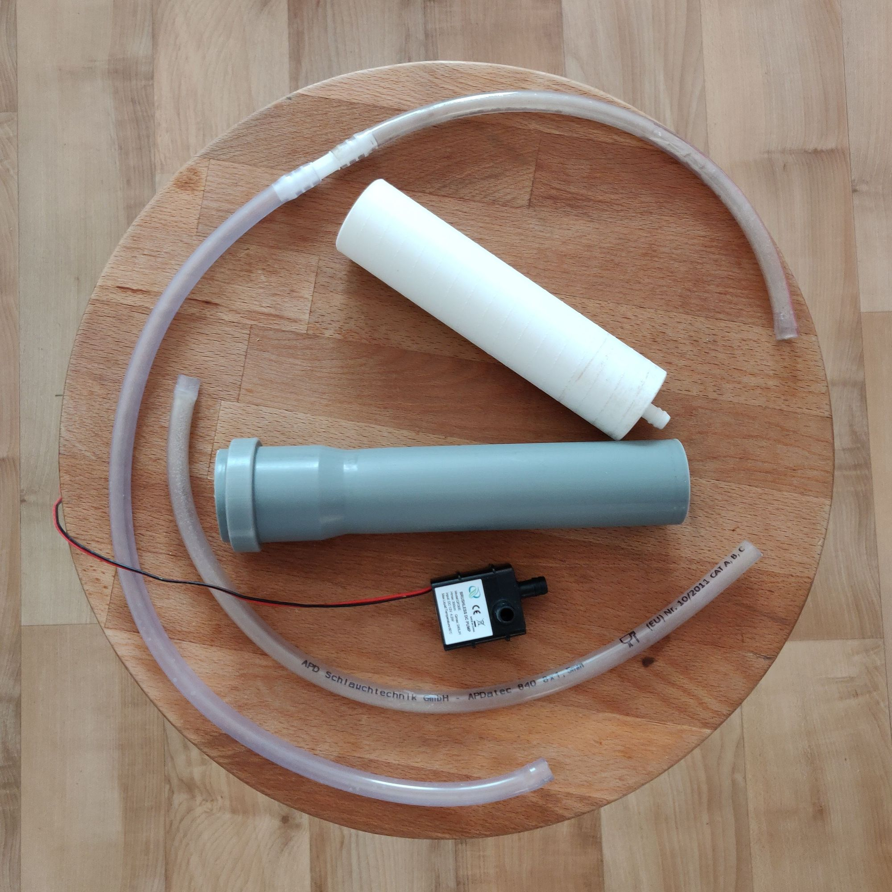
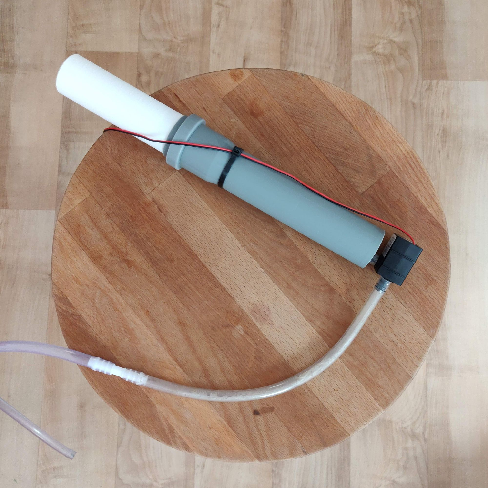

I used to build many different hydroponic systems, but most of them are installed in Industra - maker space in Brno. Now, sitting at home on quarantine I don't go the space that often, but still want to grow some lettuces.

The one was built is a simple [Deep Water Culture (DWC)](https://en.wikipedia.org/wiki/Deep_water_culture) - a bucket with a nutrient solution and a plant floating on the surface with a piece of polystyrene foam. That's it. This works nicely, but only for several days. Then plants suck all the oxygen dissolved in the water and roots will start to rot.

There are a few ways to fix this. One pretty popular is to use an air compressor, like those used fishes in aquariums. However air pumps are somewhat loud, so the idea is to replace it with a tiny DC water pump. It will push the nutrient solution through the central channel, then it flows down by a spiral that provides a relatively large surface area to contact with air and saturates it with oxygen.

Couple months ago I received a new [Prusa Mini](https://www.prusa3d.com/original-prusa-mini/) 3d-printer and yet didn't make anything that requires the full height of the printer. So this 180mm high design was born:

Cross-section of aeration tube

I didn't make any estimations on how much air it will actually be able to add, but at least it makes a nice calm sound of running water and plants didn't die yet (I may update this post in the future)

If you still want to build one you will need:

* *1x* 3d printed column
* *1x* piece of 40mm drainage pipe (sorry, don't know if it fits any US standard)
* *2x* pieces of hose with an internal diameter of 8mm - one to connect the pump to the column and one to connect pump input to the remote part of the bucket
* *1x* 12V water submersible water pump with 8mm hose connector - you can find them just for couple euro on eBay or Chinese shops
* *1x* 12V power source
* *(Optionally)* dc-dc converter - I found that the pump is too productive and still too loud, so it's better to reduce voltage to 6-7 volts.

Parts

Combined device

Model is made in Fusion360 and free to [download](https://a360.co/2KBvEl7) and the project page on [Thingiverse](https://www.thingiverse.com/thing:4315632) (under [CC BY 4.0](https://creativecommons.org/licenses/by/4.0/))