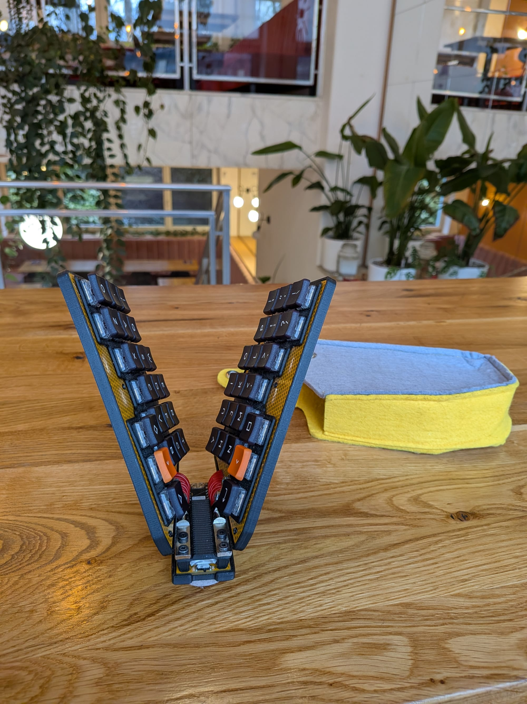
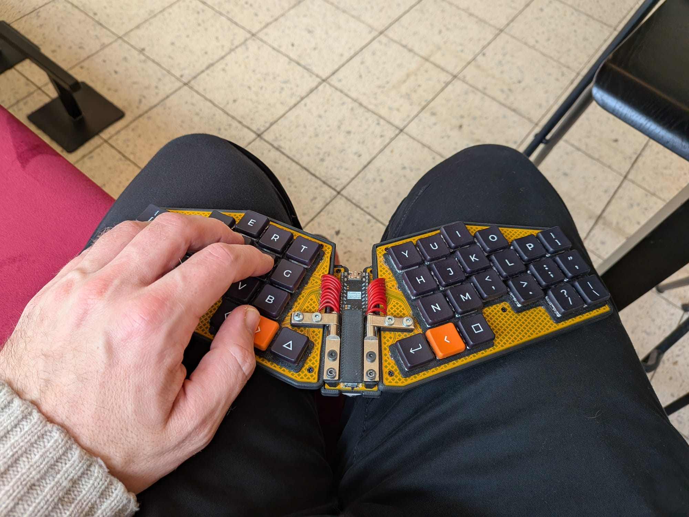
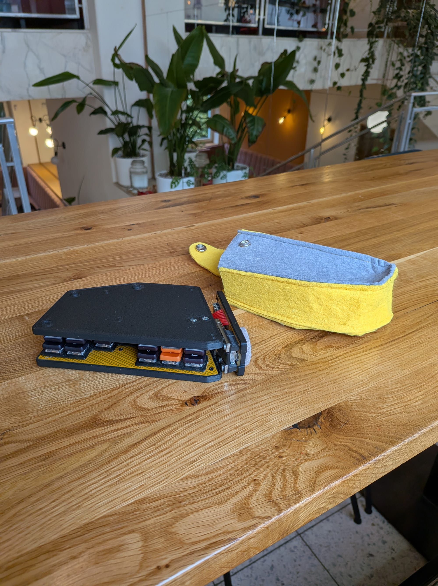
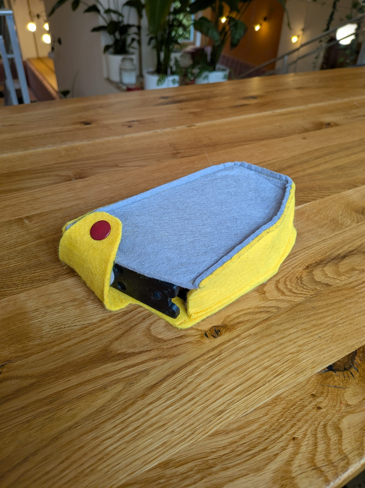

This is not a completely new keyboard, but a remake of the Crabapplepad V2 into a foldable version.

It uses a couple of friction hinges, similar to ones used for laptop lids. I bought them on AliExpress, because I wasn't able to find anything suitable in local shops. They are quite strong (about 2Nm), and the keyboard can stay in any position; it is even sturdy enough to use on my lap. I am actually typing this note on it while sitting in a coffee shop.

<!--more-->

It uses the original Crabapplepad V2 board cut into three pieces and reconnected with silicone-insulated wires—the most flexible kind available. The PCB was designed with this possibility in mind; the holes for wires were already there, even though I hadn't yet finalized the design for a foldable version.

The switches are brown (tactile) Kailh Chocs. I didn't initially include hot-swap sockets in the design, so the switches are soldered (and the diodes are buried underneath them).

The way the hinges are mounted doesn't allow for much tenting (just a few degrees). This is intentional, otherwise, the keyboard would become unstable due to the shape of the PCB.

The keyboard is always in my backpack, and I use it with either my phone or a Lenovo Legion Go (which I use as a Linux tablet). However, because the switches are still exposed when it's folded, it often used to catch on wires or other items in my bag.

To fix this, I sewed a felt shell for it a few days ago, and I couldn't be happier with the result.

I might eventually add a built-in phone stand, as there is still enough space on the top of the board.