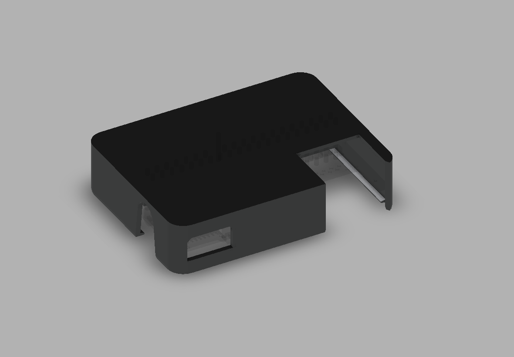
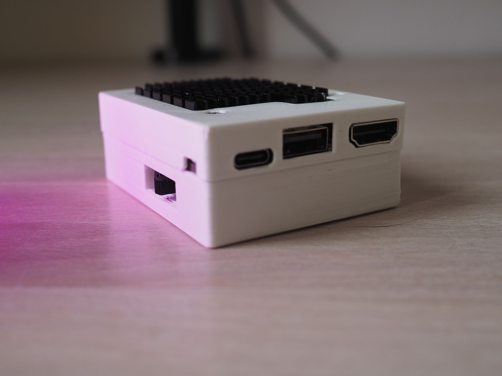

Some time ago, I began using my iPad more actively, not only for content consumption but also for creative tasks. Additionally, I have it connected to a stage manager which makes it almost a good replacement for a laptop. Almost, because I cannot code on it. I not only do web development but also play with embedded devices, and I need to directly connect devices to flash firmware and run a debugger on a chip.

A common solution to this is to connect a Raspberry Pi to it. The method for setting up and connecting is described in a [number](https://www.youtube.com/watch?v=4PAdeZ4aokk) of [videos](https://www.youtube.com/watch?v=A3qn1nqw-Gw).

It works, but there are a few things I don’t like about this setup:

• The RPI must be plugged into the iPad for power and connection.  
• If I need to move, I must unplug it and start over. I cannot continue my work from where I stopped.  
• The regular Raspberry Pi isn’t huge, but it’s big enough that I cannot put it into my pocket.

Are there smaller alternatives? Yes, the Raspberry Pi Compute Module 4 (CM4) has the same internals with a smaller footprint. So, I bought one with 8GB of RAM, 32GB of eMMC, and a built-in WiFi/Bluetooth module.

However, the module itself doesn’t have any regular connectors on the board, and it requires another board to be plugged in.

My first choice was the tiny breakout board from WaveShare, which contains everything I need:

• A USB-A connector to connect whatever I want.  
• A USB-C port for power and data.  
• An Ethernet connector if I want to use it in a different scenario

So, my initial attempt looked like this:

It’s a nice pocketable brick that works. However, I quickly encountered some limitations of this breakout board. The System-On-Chip (BCM2711) at the heart of both the RPI4 and CM4 has only one USB 2.0 lane. The regular Raspberry Pi has 4 USB 3.0 ports but it uses a special chip that converts PCIe lane (also the only one) to USB 3.0 ports. Unfortunately, our tiny board doesn’t have this feature.

As a result, the USB-C and USB-A ports cannot be used for transferring data simultaneously.

Another limitation is how the mode switch is implemented on this board. If switched to the gadget position, the CM4 will always go into flashing mode upon boot. This can be resolved by removing one transistor from the board and adding a jumper or switch, but then you lose the ability to flash eMMC with the board. Fortunately, I have another board for cases when I’ll need it.

The second problem is performance. Of course, I’m aware that the Raspberry Pi’s CPU isn’t the fastest, but in my case, the processor wasn’t the bottleneck.

A typical embedded C project with a modern RTOS (Real-Time Operating System) consists of thousands of small files that must be accessed during compilation. The performance of eMMC on CM4 is much lower compared to modern NVMe SSDs. In some cases, it can be 100-200 times slower.

RPI CM4 with Piunora and battery

So, I found another motherboard for CM4 with an NVMe connector. It’s called [Piunora](https://www.diodes-delight.com/products/piunora/). It has a header compatible with Arduino shields.

I also added a 1A battery management module and a 2000mAh battery. This is enough to keep the RPI alive for at least 5 hours.

Piunora also features an I2C Analog-to-Digital converter, so I connected the battery to the ADC through a 2-resistor voltage divider and wrote a script that blinks a red LED when the battery is low. The script is on [GitHub](https://github.com/kumekay/pocketdev)

How does it work? With the addition of the NVMe SSD, compilation time improved by 6%. Cool, but it doesn’t really change much. Overclocking to 2GHz added another 6-8%, but my battery controller didn’t handle the increased power consumption well, and I experienced brownouts a few times. So, I reverted it back to the original frequencies.

I used it for some time, but after a few months, I left it in a drawer and decided to scrap it. I still want something similar, but more performant. If only I could have a Mac Mini in a tiny portable case with a battery…